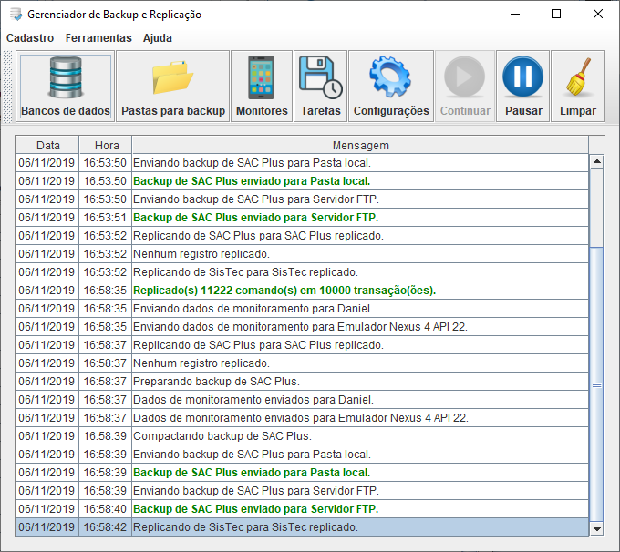
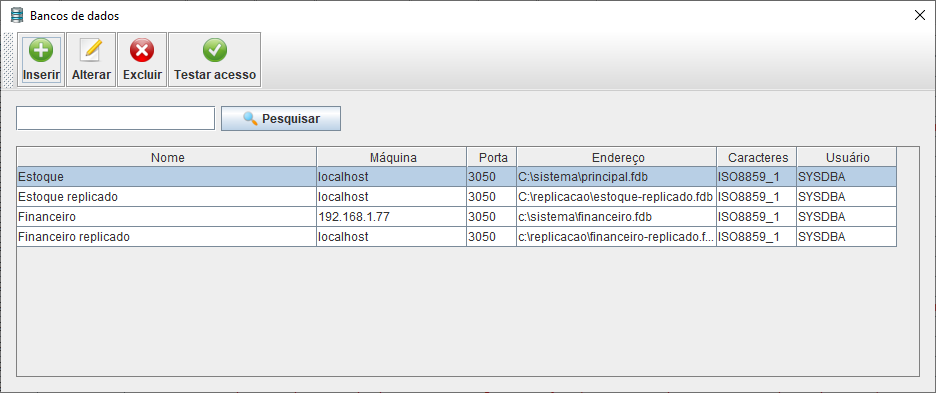
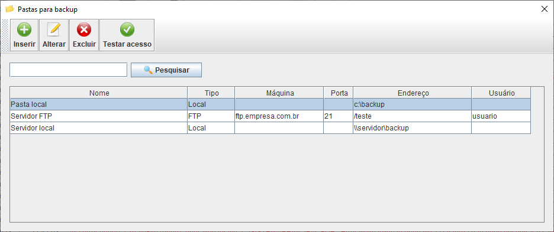
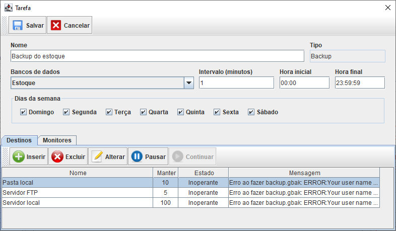
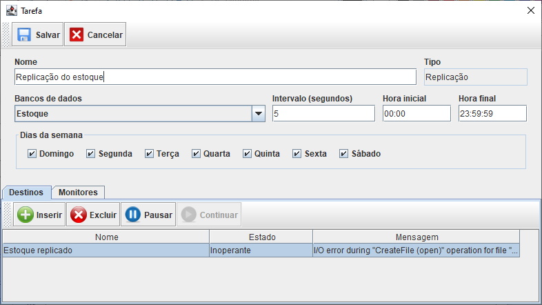
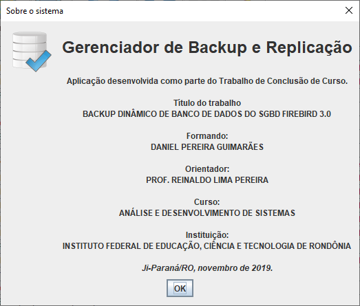

# Gerenciador de Backup e Replicação
Gerenciador de backup e replicação de bancos de dados Firebird 3.0, desenvolvido em 2019,
utilizando a linguagem Java (desktop), como parte do meu Trabalho de Conclusão de Curso (TCC) no
curso de Análise e Desenvolvimento de Sistemas do Instituto Federal de Rondônia.

### Funcionalidades

- [x] Agendamento de backup.
- [x] Replicação assíncrona.
- [x] Replicação de metadados (CREATE, ALTER, DROP).
- [x] Replicação de dados (INSERT, UPDATE, DELETE).
- [x] Backup de múltiplos bancos de dados.
- [x] Replicação de múltiplos bancos de dados.
- [x] Replicação de para múltiplos destinos.
- [x] Integração com aplicativo de monitoramento.

### Capturas de tela

